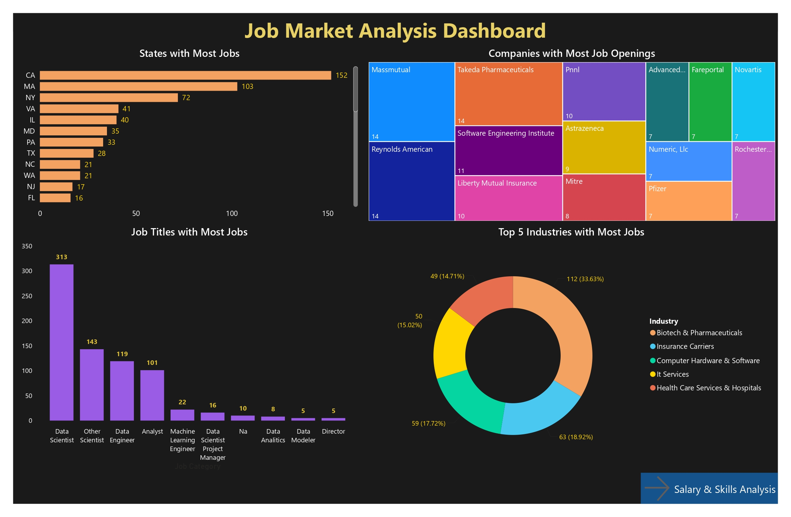
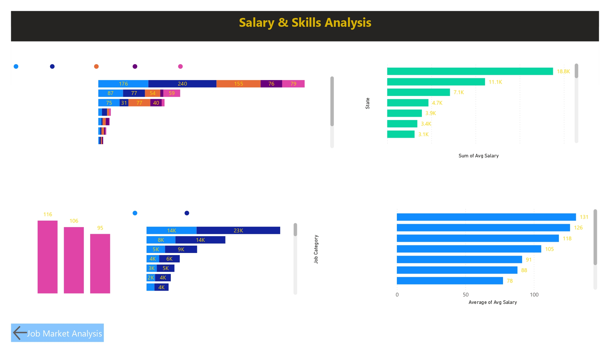

# 📊 Job Market Analysis
### Data Science Job Market Analysis using Python and Power BI

## 📌 Project Overview
This project analyzes job market trends for Data Science positions 
across the United States using a dataset of 742 job postings.
The goal is to identify most in-demand skills, top hiring companies,
salary trends and provide insights for job seekers and employers.

## 🛠️ Tools Used
- Python (Pandas, NumPy, Matplotlib)
- Power BI (Dashboard & Visualization)
- MySQL (Data Source)

## 🔍 What I Did
- Loaded and explored the raw dataset from MySQL database
- Dropped unnecessary columns not needed for analysis
- Checked and handled missing values
- Removed duplicate rows
- Standardized all categorical columns (text formatting)
- Checked outliers using Boxplots and IQR method
- Saved the final cleaned dataset
- Built interactive dashboard in Power BI with 9 charts

## 📊 What I Found
- California has the most Data Science jobs (152)
- Biotech & Pharma is the top hiring industry (33.63%)
- Python (240) and SQL (176) are most in-demand skills
- PhD holders earn highest average salary ($116K)
- Data Scientist is most common job title (313 jobs)
- Massmutual and Takeda are top hiring companies (14 each)

## 📂 Files in this Repository
- `Job_market_Analysis.csv` - Original dataset
- `cleaned_market_analysis.xlsx` - Cleaned dataset
- `Job_Market_Analysis.ipynb` - Python data cleaning notebook
- `dashboard_page1.png` - Power BI Dashboard Page 1
- `dashboard_page2.png` - Power BI Dashboard Page 2
- `Job_Market_Analysis.pptx` - Presentation
- `Job_Market_Analysis_Insights.docx` - Insights report

## 💡 Key Insights
1. California leads with 152 Data Science jobs
2. Biotech & Pharma is top hiring industry (33.63%)
3. Python & SQL are most in-demand skills
4. PhD holders earn highest average salary ($116K)
5. Data Scientist is most common role (313 jobs)
6. Massmutual & Takeda are top hiring companies

## ✅ Suggestions
- Job seekers should master Python and SQL first
- Target California or Massachusetts for better opportunities
- Pursue Masters or PhD for higher salary
- Focus on Biotech & Pharma industry

## 📈 Dashboard Preview

